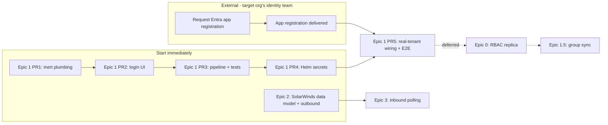

# DefectDojo (Personal Fork) — Integrations Delivery Plan

**Scope:** Microsoft Entra ID (Azure AD) SSO, and a bidirectional SolarWinds Service Desk ticketing integration, for this private DefectDojo fork.
**Status:** Approved for execution. Architecture decisions final; one PR is blocked on an external app-registration request (see §5).
**Last updated:** 2026-08-07

**Design principle — organization-agnostic by construction:** this fork is meant to function as a personal, general-purpose equivalent to DefectDojo Pro — deployable against whichever organization's Entra tenant and SolarWinds instance the operator points it at, not wired to any one employer or org. Every identity/tenant-specific value (Entra tenant ID, allowed email domain(s), SolarWinds instance URL/region, credentials) is **runtime configuration** (env vars / admin-configured model fields), never hardcoded into settings, code, or migrations. Nothing in this plan or its implementation should assume a specific organization's name, domain, or tenant — treat every such value below as a placeholder to fill in per-deployment.

This document is the reference for delivering both integrations. It is intentionally not part of the public `docs/content/` Hugo site — it's internal planning, not end-user documentation.

---

## 1. Executive Summary

We're adding Microsoft Entra ID **OIDC** single sign-on and a **SolarWinds Service Desk** ticketing integration to this fork, in that priority order. Both are scoped to ship without requiring any Pro-only DefectDojo feature — see §2 for why.

- **SSO:** re-adopt upstream DefectDojo's own pre-3.0 `social-auth-app-django` + Azure AD OIDC integration. Local username/password login stays available to everyone. New SSO users are provisioned just-in-time with zero privilege; access is granted manually via the existing Authorized Users UI.
- **SolarWinds:** a new `dojo/solarwinds/` module creates a Service Desk incident when a finding opens (outbound, async via Celery) and polls for resolution to mitigate the finding (inbound, Celery-beat — **SolarWinds Service Desk has no webhook capability**, confirmed against its real API spec).

**Critical path:** an Entra app registration must be requested from whichever organization's identity team owns the target tenant before final SSO wiring/testing (§5). Everything else — SSO plumbing, the SolarWinds module — can be built and merged (dark, behind flags) starting immediately, independent of which org it's eventually pointed at.

---

## 2. Why This Doesn't Require Rebuilding DefectDojo Pro's RBAC

Upstream's own documentation confirms two things that shape this whole plan:

> "Single Sign-On is a **DefectDojo Pro** feature. As of DefectDojo 3.0, the SSO surface — SAML, OIDC, and the bundled OAuth providers — is available only in DefectDojo Pro." — `docs/content/admin/sso/_index.md`

> "Open-source DefectDojo controls access to Products and Product Types with the **Authorized Users** model... There are no roles, no groups, and no global roles." — `docs/content/admin/user_management/OS__authorized_users.md`

So: SSO was removed from open-source DefectDojo org-wide at the 3.0 release (not stripped specifically from this fork — this fork just carries pre-3.0 remnants: `LOGIN_EXEMPT_URLS` entries for `complete/`/`oauth2/idpresponse`, and a `Dojo_Group.social_provider` field). And OS authorization was **deliberately moved back to** a simple `is_superuser` / `is_staff` / per-Product(-Type) `authorized_users` list model — confirmed live and working in this codebase:

- `dojo/db_migrations/0268_release_authorization_to_pro.py` re-introduced `Product.authorized_users` / `Product_Type.authorized_users` as real (`managed=True`) M2M fields when the RBAC tables (`Dojo_Group`, `Role`, `Product_Member`, etc.) were handed to Pro as `managed=False` shells.
- `dojo/authorization/authorization.py` implements authorization purely against `is_superuser` / `is_staff` / `authorized_users` — the RBAC shells are never consulted.
- The UI already exists: "Add Authorized User" panel on the Product and Product Type detail pages (`dojo/product/ui/views.py:1666`, `add_product_authorized_users`).

**Conclusion:** an SSO-provisioned user is just an ordinary `Dojo_User` row, immediately assignable through that existing panel. **No RBAC replica, no new models, no new migrations are needed to make SSO work smoothly with manual access grants.** A local RBAC replica only becomes necessary later if automated Entra-group → role sync is pursued — that's explicitly deferred (Epic 1.5 below), not built now. Don't add it preemptively.

---

## 3. Finalized Decisions

| # | Decision | Answer |
|---|---|---|
| 1 | Protocol | **OIDC**, not SAML |
| 2 | Library | **`social-auth-app-django`** with the `social_core.backends.azuread_tenant.AzureADTenantOAuth2` backend — re-adopting upstream's own pre-3.0 approach |
| 3 | Local login | **Stays available to everyone**, not restricted to a break-glass account. `ModelBackend` remains second in `AUTHENTICATION_BACKENDS`. |
| 4 | Provisioning | **Just-in-time** on first SSO login, restricted to the configured tenant/domain (per-deployment, env-driven), new users get zero privilege by default |
| 5 | Role assignment | **Manual**, via the existing Authorized Users panels. Automated Entra-group sync deferred (Epic 1.5). |
| 6 | Authorization schema | **No RBAC replica for this delivery** (§2). Revisit only if group-sync or per-product role granularity becomes a hard requirement. |
| 7 | SolarWinds inbound sync | **Celery-beat polling.** Confirmed: Service Desk's API has zero webhook support (§8). |
| 8 | Credentials | Secret-store / encrypted-at-rest only, for both integrations — never a plaintext DB column (the JIRA module's `password = CharField` is the anti-pattern being explicitly avoided) |

### Named assumptions (carried as risks, not blockers — see §9)
- **A1:** Entra will emit the standard OIDC claims (email/`preferred_username`, `oid`, `tid`); exact optional-claims config is owned by IT.
- **A2:** The `pro` package will not be installed into this deployment during this initiative.
- **A3:** A dedicated SolarWinds Service Desk service-account admin can be created to own the integration's API token.

---

## 4. Epic Breakdown

| Epic | Status | Depends on |
|---|---|---|
| **Epic 1** — SSO Core (Entra OIDC) | Committed, primary | Entra app registration (final wiring PR only) |
| **Epic 0** — Authorization foundation (RBAC replica) | **Deferred, conditional** — not started | Only triggered if Epic 1.5 is pursued |
| **Epic 1.5** — SSO group → role sync | **Deferred** — not started | Epic 0, Epic 1, IT group-claims config |
| **Epic 2** — SolarWinds data model + outbound sync | Committed, Phase 2 | None — can run in parallel with Epic 1 |
| **Epic 3** — SolarWinds inbound polling sync | Committed, Phase 3 | Epic 2 |



**Day-1 actions, both in parallel:**
1. File the Entra app-registration request with the target organization's identity/IT team (spec in §5) — starts the external clock.
2. Begin Epic 1 PR 1 — no external dependency.

Epic 2 (SolarWinds) has no SSO dependency and should run concurrently so the team stays utilized while the Entra request is outstanding.

---

## 5. Entra App-Registration Request Template (send to the target org's identity/IT team)

Reusable per-deployment — fill in the actual host and tenant when standing this up against a given organization's Entra tenant.

- **Type:** single-tenant App registration, Web platform, OIDC.
- **Redirect URI (reserve one per environment — staging + prod):** `https://<defectdojo-host>/complete/azuread-tenant-oauth2/`
- **Credential:** client secret, or (preferred, no expiry-driven outages) a certificate credential — delivered via a secure channel into the secret store, never email/chat.
- **ID token claims needed for MVP:** `email`/`preferred_username`, `oid`, `tid`. **Group claims are NOT required for this delivery** (only for the deferred Epic 1.5 — if requesting ahead of time to save a round trip, see §10 for the exact Graph-claims config Pro's own integration uses).
- **Values to get back:** Application (client) ID, Directory (tenant) ID, the secret or certificate.
- **Optional, for a polished break-glass experience:** none needed from IT — DefectDojo Pro's own convention (`/login?force_login_form` appended to the URL) is a good UX pattern to replicate locally; see §6.5.

---

## 6. Epic 1 — SSO Core: Technical Spec

### 6.1 Packages

Add to `requirements.txt`: `social-auth-app-django` (pulls in `social-auth-core`, which provides the `azuread_tenant.AzureADTenantOAuth2` backend). Verify the current version against Django 5.2 compatibility at implementation time — pin it, don't float. `requests` and `cryptography` (already present) satisfy the transitive needs.

### 6.2 Settings — `dojo/settings/settings.dist.py`

New env defaults (near the existing `env = environ.Env(...)` block, ~line 155-175):
```python
DD_SOCIAL_AUTH_AZUREAD_TENANT_OAUTH2_ENABLED=(bool, False),
DD_SOCIAL_AUTH_AZUREAD_TENANT_OAUTH2_KEY=(str, ""),
DD_SOCIAL_AUTH_AZUREAD_TENANT_OAUTH2_SECRET=(str, ""),
DD_SOCIAL_AUTH_AZUREAD_TENANT_OAUTH2_TENANT_ID=(str, ""),
DD_CLASSIC_AUTH_ENABLED=(bool, True),
```

Wire the existing dangling flag at line 486 — replace `CLASSIC_AUTH_ENABLED = True` with `CLASSIC_AUTH_ENABLED = env("DD_CLASSIC_AUTH_ENABLED")`.

Conditionally append the app/backend (mirroring the existing `django_prometheus` conditional pattern at line 991):
```python
AZUREAD_SSO_ENABLED = env("DD_SOCIAL_AUTH_AZUREAD_TENANT_OAUTH2_ENABLED")
if AZUREAD_SSO_ENABLED:
    INSTALLED_APPS = (*INSTALLED_APPS, "social_django")
    AUTHENTICATION_BACKENDS = (
        "social_core.backends.azuread_tenant.AzureADTenantOAuth2",
        *AUTHENTICATION_BACKENDS,  # ModelBackend stays -> local login unaffected
    )
    SOCIAL_AUTH_AZUREAD_TENANT_OAUTH2_KEY = env("DD_SOCIAL_AUTH_AZUREAD_TENANT_OAUTH2_KEY")
    SOCIAL_AUTH_AZUREAD_TENANT_OAUTH2_SECRET = env("DD_SOCIAL_AUTH_AZUREAD_TENANT_OAUTH2_SECRET")
    SOCIAL_AUTH_AZUREAD_TENANT_OAUTH2_TENANT_ID = env("DD_SOCIAL_AUTH_AZUREAD_TENANT_OAUTH2_TENANT_ID")
    SOCIAL_AUTH_JSONFIELD_ENABLED = True
    SOCIAL_AUTH_PIPELINE = (...)  # see 6.4
```
Add `social_django.context_processors.backends` and `.login_redirect` to `TEMPLATES[0]["OPTIONS"]["context_processors"]`.

**Middleware:** insert `social_django.middleware.SocialAuthExceptionMiddleware` after `AuthenticationMiddleware` (line 814) but before `dojo.middleware.LoginRequiredMiddleware` (line 818), or auth-flow exceptions will redirect-loop instead of rendering.

**URLs:** mount `path("", include("social_django.urls", namespace="social"))` in the root urlconf. `LOGIN_EXEMPT_URLS` already contains `r"complete/"` and `r"oauth2/idpresponse"` (`settings.dist.py:517,519`) — verify these resolve correctly against `URL_PREFIX`; normally no new entry is needed.

### 6.3 Migrations

**Net new `dojo` migrations: zero.** Running `social_django`'s bundled migrations creates its own `UserSocialAuth` table, which holds the Entra subject-ID (`oid`/`sub`) → `Dojo_User` link — this is sufficient for login; no field needs to be added to `Dojo_User` (which is a `proxy=True` model and can't hold new fields anyway) or `UserContactInfo`.

### 6.4 Provisioning pipeline — `dojo/user/social_pipeline.py` (new file)

Standard social-auth pipeline (`social_details → social_uid → auth_allowed → social_user → associate_by_email → create_user → associate_user → load_extra_data → user_details`) with two custom behaviors:

- **Domain restriction:** `SOCIAL_AUTH_AZUREAD_TENANT_OAUTH2_WHITELISTED_DOMAINS` — read from an env var (e.g. `DD_SOCIAL_AUTH_AZUREAD_WHITELISTED_DOMAINS`, comma-split), so the allowed domain(s) are set per-deployment rather than compiled in. Never hardcode a specific organization's domain in code.
- **Zero-privilege default:** new SSO users are created with `is_staff=False`, `is_superuser=False`, no `authorized_users` memberships. An admin grants access afterward via the existing Authorized Users panel.

**Security note (R3):** `associate_by_email` links an SSO identity to any local account with a matching email — gate it strictly to the whitelisted domain, and require `email_verified` from the token claims, to avoid an account-takeover vector via a spoofed/unverified email.

### 6.5 Login UI

Both template skins need a conditional SSO button (verified: currently no SSO block in either):
- `dojo/templates/dojo/login.html` (~line 126)
- `dojo/templates_classic/dojo/login.html`

```django

  <a class="btn btn-secondary" href=""></a>

{# existing password form #}
```
`DojoLoginView.get_context_data` (`dojo/user/ui/views.py:57`) needs extending to pass both flags. `form_valid` is untouched — SSO never enters this view.

**Break-glass UX (optional polish, not required for MVP):** DefectDojo Pro documents `/login?force_login_form` as a way to force the password form even when SSO is configured — worth replicating as a query-param check in the login view for a familiar, low-effort fallback path.

### 6.6 `django-single-session` interaction

`single_session` (gated by `SINGLE_USER_SESSION`, default off) hooks `user_logged_in`, which social-auth's standard `login()` call fires — the happy path works without changes. **One targeted test needed (R4):** confirm the pre-auth anonymous session social-auth uses to hold OAuth state/PKCE isn't evicted mid-redirect when single-session is enabled.

### 6.7 Testing

- `test_sso_pipeline.py` — mocked Entra claims through the pipeline; assert create-vs-link, zero-privilege default, domain-whitelist rejection.
- `test_sso_settings_flag.py` — flag off → no `social_django` in apps, no button; flag on → backend present.
- Extend `test_middleware_login_required.py` — assert the callback path stays login-exempt.
- Classic-login regression — password login still works with the Azure backend prepended.
- **Mock all IdP HTTP calls.** The real authorization-code redirect, redirect-URI/reply-URL correctness, consent, and PKCE are not unit-testable — reserved for manual verification against the real tenant in PR 5.

### 6.8 PR Sequence

| PR | Content | Blocked on Entra app reg? |
|---|---|---|
| **1** | Package + conditional `INSTALLED_APPS`/`AUTHENTICATION_BACKENDS`, env scaffolding, wire `CLASSIC_AUTH_ENABLED`, run `social_django` migrations | No |
| **2** | Login button (both skins), `SocialAuthExceptionMiddleware` placement | No |
| **3** | `social_pipeline.py`, unit tests against mocked claims | No |
| **4** | Helm `extraEnv`/secret plumbing, operator docs | No |
| **5** | Real client ID/secret/tenant ID, staging E2E, single-session verification | **Yes — only this PR** |

### 6.9 Secrets across deployment surfaces

- **Dev/compose:** `DD_*` via `docker-compose.yml` `environment:` blocks. Local secret goes in `docker/extra_settings/local_settings.py`, which is copied to `dojo/settings/local_settings.py` on release-mode boot (`docker/extra_settings/README.md`; `dojo/settings/settings.py:9` already `include(optional("local_settings.py"))`).
- **Prod/Helm:** client secret as a K8s Secret via `extraEnv[].valueFrom.secretKeyRef` (django/uwsgi/celery components expose `extraEnv: []` in `helm/defectdojo/values.yaml`). Never a plaintext Helm value.

---

## 7. Epic 0 / 1.5 — Deferred: RBAC Replica + Group Sync

Not started in this delivery (§2). When triggered:
- **Epic 0:** a `managed=True`, OSS-owned authorization schema (new canonical module, per `AGENTS.md`) plus a re-activated role-aware `user_has_permission` path, designed for Pro-coexistence so it doesn't collide if the `pro` package is ever added (A2).
- **Epic 1.5:** an app-registration group-claims config, a `{entra_group_id → role}` mapping UI, and a pipeline step tagging synced groups. Reference Pro's own mechanism for this (`docs/content/admin/sso/PRO__azure_ad.md`): it reads groups via the **Microsoft Graph API** (not just ID token claims), needs a Group Claim configured in Entra plus `GroupMember.Read.All`/`Group.Read.All` Graph permission, supports a regex group filter, and auto-creates/cleans up groups on sync — a good pattern to mirror rather than reinvent.

---

## 8. Epic 2 & 3 — SolarWinds Service Desk: Technical Spec

### 8.1 Source of truth

The real, current OpenAPI spec for SolarWinds Service Desk (Samanage) — `resolved_schema.json` in the repo root — title "SolarWinds Service Desk API" v0.2.20, servers `api.samanage.com` (US) / `apieu.samanage.com` (EU) / `apiau.samanage.com` (APJ). It's ~1.4MB; read specific `paths.*` entries rather than the whole file.

**Confirmed: zero webhook support.** A webhook-looking doc exists at `support.incidents.cloud.solarwinds.com` but documents a *different* SolarWinds product (Incident Response/Observability, built on the acquired Squadcast platform — on-call alerting, unrelated to Service Desk ITSM). Grepping the real spec found zero webhook mentions. Inbound sync is Celery-beat polling, full stop — do not scope a webhook path.

### 8.2 Module — `dojo/solarwinds/` (canonical `dojo/url/` layout per `AGENTS.md`)

A bespoke module, not an extension of `Tool_Configuration` — this is a JIRA-shaped domain (instance config + per-product routing + finding↔ticket link table), which the generic tool-config credential bag doesn't model. Reuses the **encryption** pattern `tool_config` already has, explicitly avoiding the JIRA module's plaintext `password = CharField` anti-pattern (`dojo/jira/models.py:13`).

```python
class SolarWinds_Instance(models.Model):
    configuration_name = models.CharField(max_length=255, unique=True)
    region = models.CharField(max_length=3, choices=[("US","US"),("EU","EU"),("AU","APJ")], default="US")
    api_token = models.CharField(max_length=900)   # encrypted via dojo_crypto_encrypt
    service_account_email = models.CharField(max_length=255, blank=True)
    default_site_id = models.CharField(max_length=64, blank=True)
    default_department_id = models.CharField(max_length=64, blank=True)
    open_state_id = models.CharField(max_length=64)        # tenant-specific
    resolved_state_ids = models.JSONField(default=list)    # tenant-specific
    severity_priority_map = models.JSONField(default=dict) # {"Critical": <priority_id>, ...} tenant-specific
    push_enabled = models.BooleanField(default=False)
    poll_enabled = models.BooleanField(default=False)

class SolarWinds_Product(models.Model):   # per-product routing, analogous to JIRA_Project
    solarwinds_instance = models.ForeignKey(SolarWinds_Instance, on_delete=models.CASCADE)
    product = models.ForeignKey("dojo.Product", on_delete=models.CASCADE)
    site_id = models.CharField(max_length=64, blank=True)
    department_id = models.CharField(max_length=64, blank=True)
    group_assignee_id = models.CharField(max_length=64, blank=True)
    push_all_findings = models.BooleanField(default=False)

class SolarWinds_Ticket(models.Model):    # link table, analogous to JIRA_Issue (dojo/jira/models.py:177)
    finding = models.OneToOneField("dojo.Finding", on_delete=models.CASCADE)
    incident_id = models.CharField(max_length=64, db_index=True)
    incident_number = models.CharField(max_length=64, blank=True)
    last_synced_state_id = models.CharField(max_length=64, blank=True)  # reconciliation cursor
    external_updated_at = models.DateTimeField(null=True, blank=True)
    created = models.DateTimeField(auto_now_add=True)
```

**Why `state_id`/`priority` are tenant config, not enums:** the spec's `POST /incidents` types both as references to per-tenant lookups, not fixed strings. Real values must be resolved from the live tenant at config time and stored in `open_state_id`/`resolved_state_ids`/`severity_priority_map` — never hardcoded.

### 8.3 API client — `dojo/solarwinds/client.py`

Thin `requests` wrapper. Every call sends:
```
X-Samanage-Authorization: Bearer <decrypted api_token>
Accept: application/vnd.samanage.v2.1+json
Content-Type: application/json
```
Methods: `create_incident(payload)` → `POST /incidents`; `get_incident(id)` → `GET /incidents/{id}`; `list_incidents_updated_since(...)` → `GET /incidents` using the spec's `Updated_at` filter (incremental polling, not full scans); `add_comment(incident_id, body, is_private=True)` → `POST /incidents/{incident_id}/comments`. Centralize 429 handling with backoff here.

**Auth details (from the spec):** token generated per-admin-user in the Service Desk UI; **regenerating invalidates all prior tokens for that user.** Use a **dedicated service-account admin** for the integration (A3), not a shared personal token — plus a scheduled health-check task pinging the API and alerting on 401.

**Rate limits:** 1000 calls/min (Advanced plan) / 1500/min (Premier) — the polling design must use one batched, filtered query per instance, never per-ticket GETs.

### 8.4 Credential encryption

`api_token` stored via `dojo_crypto_encrypt()` on save / `prepare_for_view()` on read — `dojo/utils.py:1026`, AES-256-GCM, the exact pattern `dojo/tool_config/ui/views.py:57,80` already uses. Mirror JIRA's "keep existing value if field left blank on edit" form behavior (`dojo/jira/forms.py:86-93`).

### 8.5 Outbound flow (DefectDojo → SolarWinds)

`dojo/solarwinds/services.py` builds the incident payload from a Finding:

| SolarWinds field | Source |
|---|---|
| `incident.name` (≤255 chars) | `f"[DefectDojo] {finding.title}"[:255]` |
| `incident.description` | Finding description + severity + deep link back to the finding |
| `incident.state_id` | `instance.open_state_id` |
| `incident.priority` | `instance.severity_priority_map[finding.severity]` |
| `incident.site_id` / `department_id` | `SolarWinds_Product` override → instance default |
| `incident.group_assignee_id` | `SolarWinds_Product.group_assignee_id` |
| `incident.tag_list` | `"defectdojo,finding-{id}"` |

After create: write the `SolarWinds_Ticket` link row, then post a correlation comment (`POST /incidents/{id}/comments`, `is_private=True`) for audit trail.

**Hook point:** mirror JIRA's explicit-parameter pattern (`finding.save(push_to_jira=...)` threaded through `dojo/finding/helper.py:1238`), not a signal — add a parallel `_save_finding_with_solarwinds_sync`, dispatched async via Celery.

### 8.6 Inbound flow (SolarWinds → DefectDojo, Celery-beat)

Register in `CELERY_BEAT_SCHEDULE` (`settings.dist.py:906`):
```python
"solarwinds-poll-resolved": {
    "task": "dojo.solarwinds.tasks.poll_resolved_incidents",
    "schedule": crontab(minute="*/10"),
    "options": {"expires": 9 * 60},
},
```
Logic: for each `poll_enabled` instance, call `list_incidents_updated_since(...)`; join against open `SolarWinds_Ticket` rows; where `state_id` ∈ `resolved_state_ids`, mitigate the linked finding (`active=False`, `is_mitigated=True`, `mitigated=now()`); update the `last_synced_state_id` cursor for idempotency. This cursor design means a future webhook (should SolarWinds ever add one) could call the same reconciliation function with zero schema change — a latent capability, not a committed enhancement.

**Open technical risk (R8):** the dereferenced spec didn't expose explicit `page`/`per_page` params on `GET /incidents` in what was reviewed — Samanage conventionally paginates via `?page=&per_page=` + `X-Total-Count`. Confirm against a live tenant before finalizing the poll loop.

---

## 9. Risk Register

| ID | Risk | Mitigation |
|---|---|---|
| R1 | OS authorization is binary per product, no Reader/Writer/Owner granularity | Acceptable for launch (§2); revisit only if scoped roles become a hard requirement |
| R2 | Middleware ordering — `SocialAuthExceptionMiddleware` misplaced causes redirect loops | Insert after `AuthenticationMiddleware`, before `LoginRequiredMiddleware` |
| R3 | `associate_by_email` account-takeover vector | Gate to whitelisted tenant domain + require verified email |
| R4 | `django-single-session` may evict the pre-auth OAuth/PKCE session | Targeted integration test before enabling `SINGLE_USER_SESSION` alongside SSO |
| R5 | Entra app-registration lead time (external, IT-owned) | Only PR 5 blocked; PRs 1-4 ship dark |
| R6 | SolarWinds token rotation breaks sync silently | Dedicated service account + health-check task + runbook |
| R7 | SolarWinds rate limits (1000-1500/min) | Batched `Updated_at`-filtered polling only, never per-ticket calls |
| R8 | SolarWinds `GET /incidents` pagination unconfirmed | Verify against a live tenant before finalizing the poll loop |
| R9 | `finding.severity` → SolarWinds `priority_id` mapping is tenant-specific | Captured in `severity_priority_map` at config time, never assumed |
| R10 | Upstream DefectDojo drift — restored SSO code diverges from a future upstream re-add | Review periodically against upstream tags; this is intentionally isolated in `social_pipeline.py`/settings, not scattered |
| R11 | Repeating JIRA's plaintext-credential anti-pattern for SolarWinds | Code-review gate requiring `dojo_crypto_encrypt` usage |
| R12 | `pro` package installed later, colliding with any OSS auth work | A2 holds for this delivery; if Epic 0 is ever built, design explicitly for Pro-coexistence |

---

## 10. Rollout Plan

1. **Dark launch:** merge Epic 1 PR 1/2 with the flag off — zero production effect.
2. **Staging enablement:** flag on in staging against the real Entra app registration (PR 5); run the full E2E checklist (first login, repeat login, logout, break-glass, single-session).
3. **Pilot cohort:** enable in prod for a small stakeholder + dev group; local login remains fully available; grant access manually (dev team → `is_staff`, stakeholders → per-product `authorized_users`).
4. **GA:** announce; keep local login for everyone; monitor break-glass usage.
5. **SolarWinds:** roll Epic 2 to one pilot product first (validate the tenant-specific lookups + token), then broaden; enable Epic 3 polling only after outbound is stable.
6. **Rollback:** SSO → flip the flag off (instant; JIT-created users remain, harmless). SolarWinds → disable the per-product mapping or pause the Celery-beat task.

---

## 11. Engineering Task List

**Epic 1 (SSO):**
- [ ] Add `social-auth-app-django`; conditional `INSTALLED_APPS`/`AUTHENTICATION_BACKENDS`; run `social_django` migrations *(PR 1)*
- [ ] `DD_SOCIAL_AUTH_*` / `DD_CLASSIC_AUTH_ENABLED` env defaults; wire the dangling `CLASSIC_AUTH_ENABLED` flag *(PR 1)*
- [ ] Mount `social_django.urls`; verify exempt-URL resolution; place `SocialAuthExceptionMiddleware` *(PR 1)*
- [ ] SSO button + flag context in `DojoLoginView`, both template skins *(PR 2)*
- [ ] `dojo/user/social_pipeline.py` — domain whitelist, zero-privilege default, email-association gating *(PR 3)*
- [ ] Unit tests: pipeline, settings-flag on/off, exempt-URL, classic-login regression *(PR 3)*
- [ ] Helm `extraEnv`/secret plumbing + operator docs *(PR 4)*
- [ ] Staging E2E against real Entra app registration; single-session verification *(PR 5, blocked)*

**Epic 2 (SolarWinds config + outbound):**
- [ ] `dojo/solarwinds/` module scaffold + `SolarWinds_Instance`/`SolarWinds_Product`/`SolarWinds_Ticket` models + migration
- [ ] Encrypted `api_token` via `dojo_crypto_encrypt`/`prepare_for_view`; JIRA-style re-entry form
- [ ] `client.py` (headers, region base URL, 429/backoff); `services.py` payload builder
- [ ] Config-time helper to resolve tenant `state_id`/`priority` lookups into instance config
- [ ] `ui/` + `api/` for instance/product configuration

**Epic 3 (SolarWinds sync):**
- [ ] Outbound `_save_finding_with_solarwinds_sync` hook + async Celery dispatch + correlation comment
- [ ] `poll_resolved_incidents` Celery-beat task with `Updated_at`-filtered querying + cursor-based reconciliation
- [ ] Token health-check task + 401 alert
- [ ] Integration tests against a recorded/mocked Samanage API; state-mapping + idempotency unit tests

---

## 12. Key Files Referenced

- `dojo/settings/settings.dist.py` — `AUTHENTICATION_BACKENDS` (469), `CLASSIC_AUTH_ENABLED` (486), `LOGIN_EXEMPT_URLS` (508-523), `INSTALLED_APPS` (773), `MIDDLEWARE` (806-824), `CELERY_BEAT_SCHEDULE` (906)
- `dojo/db_migrations/0268_release_authorization_to_pro.py` — RBAC-to-Pro release, `authorized_users` reintroduction
- `dojo/authorization/authorization.py` — OS enforcement path
- `dojo/authorization/models.py` — the eight `managed=False` RBAC shells, `Dojo_Group.social_provider`
- `dojo/product/ui/views.py:1666` — `add_product_authorized_users`
- `dojo/user/ui/views.py:57` — `DojoLoginView`
- `dojo/user/models.py` — `Dojo_User` (proxy model), `UserContactInfo`
- `dojo/jira/models.py`, `dojo/jira/helper.py`, `dojo/jira/views.py` — structural reference for Epic 2/3 (not the layout to copy — see `AGENTS.md`)
- `dojo/finding/helper.py:1238` — `_save_finding_with_jira_sync`, the pattern Epic 2's hook mirrors
- `dojo/utils.py:1026` — `dojo_crypto_encrypt`
- `dojo/tool_config/ui/views.py:57,80` — encryption usage pattern
- `AGENTS.md` — canonical `dojo/url/` module layout for `dojo/solarwinds/` and any future `dojo/sso/` module
- `resolved_schema.json` (repo root) — real SolarWinds Service Desk OpenAPI spec
- `docs/content/admin/sso/_index.md`, `docs/content/admin/sso/PRO__azure_ad.md`, `docs/content/admin/user_management/OS__authorized_users.md` — upstream's own documentation confirming the 3.0 SSO/RBAC split
