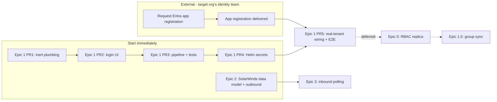

# DefectDojo (Personal Fork) — Integrations Delivery Plan

**Scope:** Microsoft Entra ID (Azure AD) SSO, a role-based access control reactivation ("Epic 0"), and a bidirectional SolarWinds Service Desk ticketing integration, for this private DefectDojo fork.
**Status:** Approved for execution. Architecture decisions final; one SSO PR is blocked on an external app-registration request (see §5). Epic 0 (§7) moved from deferred to active on 2026-08-09 — see that section for the full spec.
**Last updated:** 2026-08-09

**Design principle — organization-agnostic by construction:** this fork is meant to function as a personal, general-purpose equivalent to DefectDojo Pro — deployable against whichever organization's Entra tenant and SolarWinds instance the operator points it at, not wired to any one employer or org. Every identity/tenant-specific value (Entra tenant ID, allowed email domain(s), SolarWinds instance URL/region, credentials) is **runtime configuration** (env vars / admin-configured model fields), never hardcoded into settings, code, or migrations. Nothing in this plan or its implementation should assume a specific organization's name, domain, or tenant — treat every such value below as a placeholder to fill in per-deployment.

This document is the reference for delivering both integrations. It is intentionally not part of the public `docs/content/` Hugo site — it's internal planning, not end-user documentation.

---

## 1. Executive Summary

We're adding Microsoft Entra ID **OIDC** single sign-on and a **SolarWinds Service Desk** ticketing integration to this fork, in that priority order. Both are scoped to ship without requiring any Pro-only DefectDojo feature — see §2 for why.

- **SSO:** re-adopt upstream DefectDojo's own pre-3.0 `social-auth-app-django` + Azure AD OIDC integration. Local username/password login stays available to everyone. New SSO users are provisioned just-in-time with zero privilege; access is granted manually via the existing Authorized Users UI.
- **SolarWinds:** a new `dojo/solarwinds/` module creates a Service Desk incident when a finding opens (outbound, async via Celery) and polls for resolution to mitigate the finding (inbound, Celery-beat — **SolarWinds Service Desk has no webhook capability**, confirmed against its real API spec).

**Critical path:** an Entra app registration must be requested from whichever organization's identity team owns the target tenant before final SSO wiring/testing (§5). Everything else — SSO plumbing, the SolarWinds module — can be built and merged (dark, behind flags) starting immediately, independent of which org it's eventually pointed at.

---

## 2. Why This Doesn't Require Rebuilding DefectDojo Pro's RBAC

Upstream's own documentation confirms two things that shape this whole plan:

> "Single Sign-On is a **DefectDojo Pro** feature. As of DefectDojo 3.0, the SSO surface — SAML, OIDC, and the bundled OAuth providers — is available only in DefectDojo Pro." — `docs/content/admin/sso/_index.md`

> "Open-source DefectDojo controls access to Products and Product Types with the **Authorized Users** model... There are no roles, no groups, and no global roles." — `docs/content/admin/user_management/OS__authorized_users.md`

So: SSO was removed from open-source DefectDojo org-wide at the 3.0 release (not stripped specifically from this fork — this fork just carries pre-3.0 remnants: `LOGIN_EXEMPT_URLS` entries for `complete/`/`oauth2/idpresponse`, and a `Dojo_Group.social_provider` field). And OS authorization was **deliberately moved back to** a simple `is_superuser` / `is_staff` / per-Product(-Type) `authorized_users` list model — confirmed live and working in this codebase:

- `dojo/db_migrations/0268_release_authorization_to_pro.py` re-introduced `Product.authorized_users` / `Product_Type.authorized_users` as real (`managed=True`) M2M fields when the RBAC tables (`Dojo_Group`, `Role`, `Product_Member`, etc.) were handed to Pro as `managed=False` shells.
- `dojo/authorization/authorization.py` implements authorization purely against `is_superuser` / `is_staff` / `authorized_users` — the RBAC shells are never consulted.
- The UI already exists: "Add Authorized User" panel on the Product and Product Type detail pages (`dojo/product/ui/views.py:1666`, `add_product_authorized_users`).

**Conclusion (superseded 2026-08-09, reasoning above still holds — see §7):** an SSO-provisioned user is just an ordinary `Dojo_User` row, immediately assignable through the Authorized Users panel, and that was sufficient to ship SSO without any RBAC work — nothing above was wrong. What changed is a downstream requirement: `authorized_users` is all-or-nothing per Product/Product Type (no read-only tier), which blocks granting stakeholders read-only access while dev teams get edit access. That's not an SSO problem — it surfaced *because* SSO made onboarding easy enough to expose the gap — and it doesn't require Entra group-claim sync (Epic 1.5 stays deferred, untouched). It requires the RBAC schema this fork already has sitting inert in its database (§7). Epic 0 is now active.

---

## 3. Finalized Decisions

| # | Decision | Answer |
|---|---|---|
| 1 | Protocol | **OIDC**, not SAML |
| 2 | Library | **`social-auth-app-django`** with the `social_core.backends.azuread_tenant.AzureADTenantOAuth2` backend — re-adopting upstream's own pre-3.0 approach |
| 3 | Local login | **Stays available to everyone**, not restricted to a break-glass account. `ModelBackend` remains second in `AUTHENTICATION_BACKENDS`. |
| 4 | Provisioning | **Just-in-time** on first SSO login, restricted to the configured tenant/domain (per-deployment, env-driven), new users get zero privilege by default |
| 5 | Role assignment | **Manual**, via the existing Authorized Users panels. Automated Entra-group sync deferred (Epic 1.5). |
| 6 | Authorization schema | **No RBAC replica for this delivery** (§2). Revisit only if group-sync or per-product role granularity becomes a hard requirement. |
| 7 | SolarWinds inbound sync | **Celery-beat polling.** Confirmed: Service Desk's API has zero webhook support (§8). |
| 8 | Credentials | Secret-store / encrypted-at-rest only, for both integrations — never a plaintext DB column (the JIRA module's `password = CharField` is the anti-pattern being explicitly avoided) |

### Named assumptions (carried as risks, not blockers — see §9)
- **A1:** Entra will emit the standard OIDC claims (email/`preferred_username`, `oid`, `tid`); exact optional-claims config is owned by IT.
- **A2:** The `pro` package will not be installed into this deployment during this initiative.
- **A3:** A dedicated SolarWinds Service Desk service-account admin can be created to own the integration's API token.

---

## 4. Epic Breakdown

| Epic | Status | Depends on |
|---|---|---|
| **Epic 1** — SSO Core (Entra OIDC) | **Shipped**, local E2E verified 2026-08-08 | Entra app registration (final wiring PR only) |
| **Epic 0** — Authorization reactivation (RBAC tables + roles) | **Active** — spec finalized 2026-08-09 (§7), no PRs merged yet | None — independent of Epic 1/1.5 |
| **Epic 1.5** — SSO group → role sync | **Deferred** — not started, not needed for Epic 0 | Epic 0, Epic 1, IT group-claims config |
| **Epic 2** — SolarWinds data model + outbound sync | Committed, Phase 2 | None — can run in parallel with Epic 1 |
| **Epic 3** — SolarWinds inbound polling sync | Committed, Phase 3 | Epic 2 |



**Day-1 actions, both in parallel:**
1. File the Entra app-registration request with the target organization's identity/IT team (spec in §5) — starts the external clock.
2. Begin Epic 1 PR 1 — no external dependency.

Epic 2 (SolarWinds) has no SSO dependency and should run concurrently so the team stays utilized while the Entra request is outstanding.

---

## 5. Entra App-Registration Request Template (send to the target org's identity/IT team)

Reusable per-deployment — fill in the actual host and tenant when standing this up against a given organization's Entra tenant.

- **Type:** single-tenant App registration, Web platform, OIDC.
- **Redirect URI (reserve one per environment — staging + prod):** `https://<defectdojo-host>/complete/azuread-tenant-oauth2/`
- **Credential:** client secret, or (preferred, no expiry-driven outages) a certificate credential — delivered via a secure channel into the secret store, never email/chat.
- **ID token claims needed for MVP:** `email`/`preferred_username`, `oid`, `tid`. **Group claims are NOT required for this delivery** (only for the deferred Epic 1.5 — if requesting ahead of time to save a round trip, see §10 for the exact Graph-claims config Pro's own integration uses).
- **Values to get back:** Application (client) ID, Directory (tenant) ID, the secret or certificate.
- **Optional, for a polished break-glass experience:** none needed from IT — DefectDojo Pro's own convention (`/login?force_login_form` appended to the URL) is a good UX pattern to replicate locally; see §6.5.

---

## 6. Epic 1 — SSO Core: Technical Spec

### 6.1 Packages

Add to `requirements.txt`: `social-auth-app-django` (pulls in `social-auth-core`, which provides the `azuread_tenant.AzureADTenantOAuth2` backend). Verify the current version against Django 5.2 compatibility at implementation time — pin it, don't float. `requests` and `cryptography` (already present) satisfy the transitive needs.

### 6.2 Settings — `dojo/settings/settings.dist.py`

New env defaults (near the existing `env = environ.Env(...)` block, ~line 155-175):
```python
DD_SOCIAL_AUTH_AZUREAD_TENANT_OAUTH2_ENABLED=(bool, False),
DD_SOCIAL_AUTH_AZUREAD_TENANT_OAUTH2_KEY=(str, ""),
DD_SOCIAL_AUTH_AZUREAD_TENANT_OAUTH2_SECRET=(str, ""),
DD_SOCIAL_AUTH_AZUREAD_TENANT_OAUTH2_TENANT_ID=(str, ""),
DD_CLASSIC_AUTH_ENABLED=(bool, True),
```

Wire the existing dangling flag at line 486 — replace `CLASSIC_AUTH_ENABLED = True` with `CLASSIC_AUTH_ENABLED = env("DD_CLASSIC_AUTH_ENABLED")`.

Conditionally append the app/backend (mirroring the existing `django_prometheus` conditional pattern at line 991):
```python
AZUREAD_SSO_ENABLED = env("DD_SOCIAL_AUTH_AZUREAD_TENANT_OAUTH2_ENABLED")
if AZUREAD_SSO_ENABLED:
    INSTALLED_APPS = (*INSTALLED_APPS, "social_django")
    AUTHENTICATION_BACKENDS = (
        "social_core.backends.azuread_tenant.AzureADTenantOAuth2",
        *AUTHENTICATION_BACKENDS,  # ModelBackend stays -> local login unaffected
    )
    SOCIAL_AUTH_AZUREAD_TENANT_OAUTH2_KEY = env("DD_SOCIAL_AUTH_AZUREAD_TENANT_OAUTH2_KEY")
    SOCIAL_AUTH_AZUREAD_TENANT_OAUTH2_SECRET = env("DD_SOCIAL_AUTH_AZUREAD_TENANT_OAUTH2_SECRET")
    SOCIAL_AUTH_AZUREAD_TENANT_OAUTH2_TENANT_ID = env("DD_SOCIAL_AUTH_AZUREAD_TENANT_OAUTH2_TENANT_ID")
    SOCIAL_AUTH_JSONFIELD_ENABLED = True
    SOCIAL_AUTH_PIPELINE = (...)  # see 6.4
```
Add `social_django.context_processors.backends` and `.login_redirect` to `TEMPLATES[0]["OPTIONS"]["context_processors"]`.

**Middleware:** insert `social_django.middleware.SocialAuthExceptionMiddleware` after `AuthenticationMiddleware` (line 814) but before `dojo.middleware.LoginRequiredMiddleware` (line 818), or auth-flow exceptions will redirect-loop instead of rendering.

**URLs:** mount `path("", include("social_django.urls", namespace="social"))` in the root urlconf. `LOGIN_EXEMPT_URLS` already contains `r"complete/"` and `r"oauth2/idpresponse"` (`settings.dist.py:517,519`) — verify these resolve correctly against `URL_PREFIX`; normally no new entry is needed.

### 6.3 Migrations

**Net new `dojo` migrations: zero.** Running `social_django`'s bundled migrations creates its own `UserSocialAuth` table, which holds the Entra subject-ID (`oid`/`sub`) → `Dojo_User` link — this is sufficient for login; no field needs to be added to `Dojo_User` (which is a `proxy=True` model and can't hold new fields anyway) or `UserContactInfo`.

### 6.4 Provisioning pipeline — `dojo/user/social_pipeline.py` (new file)

Standard social-auth pipeline (`social_details → social_uid → auth_allowed → social_user → associate_by_email → create_user → associate_user → load_extra_data → user_details`) with two custom behaviors:

- **Domain restriction:** `SOCIAL_AUTH_AZUREAD_TENANT_OAUTH2_WHITELISTED_DOMAINS` — read from an env var (e.g. `DD_SOCIAL_AUTH_AZUREAD_WHITELISTED_DOMAINS`, comma-split), so the allowed domain(s) are set per-deployment rather than compiled in. Never hardcode a specific organization's domain in code.
- **Zero-privilege default:** new SSO users are created with `is_staff=False`, `is_superuser=False`, no `authorized_users` memberships. An admin grants access afterward via the existing Authorized Users panel.

**Security note (R3):** `associate_by_email` links an SSO identity to any local account with a matching email — gate it strictly to the whitelisted domain, and require `email_verified` from the token claims, to avoid an account-takeover vector via a spoofed/unverified email.

### 6.5 Login UI

Both template skins need a conditional SSO button (verified: currently no SSO block in either):
- `dojo/templates/dojo/login.html` (~line 126)
- `dojo/templates_classic/dojo/login.html`

```django

  <a class="btn btn-secondary" href=""></a>

{# existing password form #}
```
`DojoLoginView.get_context_data` (`dojo/user/ui/views.py:57`) needs extending to pass both flags. `form_valid` is untouched — SSO never enters this view.

**Break-glass UX (optional polish, not required for MVP):** DefectDojo Pro documents `/login?force_login_form` as a way to force the password form even when SSO is configured — worth replicating as a query-param check in the login view for a familiar, low-effort fallback path.

### 6.6 `django-single-session` interaction

`single_session` (gated by `SINGLE_USER_SESSION`, default off) hooks `user_logged_in`, which social-auth's standard `login()` call fires — the happy path works without changes. **One targeted test needed (R4):** confirm the pre-auth anonymous session social-auth uses to hold OAuth state/PKCE isn't evicted mid-redirect when single-session is enabled.

### 6.7 Testing

- `test_sso_pipeline.py` — mocked Entra claims through the pipeline; assert create-vs-link, zero-privilege default, domain-whitelist rejection.
- `test_sso_settings_flag.py` — flag off → no `social_django` in apps, no button; flag on → backend present.
- Extend `test_middleware_login_required.py` — assert the callback path stays login-exempt.
- Classic-login regression — password login still works with the Azure backend prepended.
- **Mock all IdP HTTP calls.** The real authorization-code redirect, redirect-URI/reply-URL correctness, consent, and PKCE are not unit-testable — reserved for manual verification against the real tenant in PR 5.

### 6.8 PR Sequence

| PR | Content | Blocked on Entra app reg? |
|---|---|---|
| **1** | Package + conditional `INSTALLED_APPS`/`AUTHENTICATION_BACKENDS`, env scaffolding, wire `CLASSIC_AUTH_ENABLED`, run `social_django` migrations | No |
| **2** | Login button (both skins), `SocialAuthExceptionMiddleware` placement | No |
| **3** | `social_pipeline.py`, unit tests against mocked claims | No |
| **4** | Helm `extraEnv`/secret plumbing, operator docs | No |
| **5** | Real client ID/secret/tenant ID, staging E2E, single-session verification | **Yes — only this PR** |

### 6.9 Secrets across deployment surfaces

- **Dev/compose:** `DD_*` via `docker-compose.yml` `environment:` blocks. Local secret goes in `docker/extra_settings/local_settings.py`, which is copied to `dojo/settings/local_settings.py` on release-mode boot (`docker/extra_settings/README.md`; `dojo/settings/settings.py:9` already `include(optional("local_settings.py"))`).
- **Prod/Helm:** client secret as a K8s Secret via `extraEnv[].valueFrom.secretKeyRef` (django/uwsgi/celery components expose `extraEnv: []` in `helm/defectdojo/values.yaml`). Never a plaintext Helm value.

---

## 7. Epic 0 — Authorization Reactivation (Active)

**Trigger:** manual per-user access grants via `authorized_users` turned out to be all-or-nothing (no read-only tier) — blocking "stakeholders get read-only per project, dev team gets edit access per project" without hand-managing every individual. **A2 is now permanently confirmed false** — this fork will never install the paid `pro` package — which removes the only reason Epic 0 was deferred (designing for Pro-coexistence). Epic 1.5 (SSO group-claims sync) stays fully deferred and is not required for any of this — role/group assignment remains 100% manual, same operating model as `authorized_users` today.

Drafted 2026-08-09 by three specialized planning passes (architecture, backend, frontend) against the live codebase and database, then reconciled where they conflicted. Two corrections from that reconciliation, verified directly against the running stack — cited because both the codebase and future readers should trust this section's numbers over any single pass's:
- Next migration number is **`0278`** (latest applied is `0277_seed_deduplication_execution_mode`).
- `dojo_product_type_member` has **1 real row today** (fixture-seeded: `product_type=1, user=1 (admin), role=4 (Owner)`, loaded by `dojo/fixtures/product_type.json` via `docker/entrypoint-first-boot.sh`) — not empty. This row goes live functionally the moment enforcement is enabled (§7.3). Harmless here since the admin account is already superuser, but every fresh install reproduces it, and it's a genuine semantic change worth calling out in the cutover PR rather than discovering later.

### 7.1 What's already there vs. what needs building

The 7 legacy RBAC tables (`dojo_dojo_group`, `dojo_dojo_group_member`, `dojo_role`, `dojo_product_member`, `dojo_product_group`, `dojo_product_type_member`, `dojo_product_type_group`, `dojo_global_role`) physically exist, schema-correct, in the live database — created by pre-3.0 migrations, never dropped, currently declared `managed=False` in `dojo/authorization/models.py` and consulted by nothing. `dojo_role` is seeded: `Reader`, `Writer`, `Maintainer`, `Owner` (`is_owner=True`), `API_Importer`. No UI, no REST API, and no enforcement logic reference any of the eight classes anywhere in the current tree — confirmed by reading `dojo/authorization/authorization.py`, `dojo/authorization/query_registrations.py`, and the "moved to Pro" comments in `dojo/urls.py` (~lines 104-133).

The full pre-3.0 implementation is recoverable from git history at commit `db1932c9e` (immediate parent of `952a56d13`, "Tailwind UI rebuild, legacy authorization, OS surface removals" — the actual OS-3.0 split commit) — but it is **reference material, not a patch source**. That commit predates a substantial rewrite: call sites keyed on the `Permissions` enum dropped from 910 to 10 between `db1932c9e` and today, replaced by an `Action`-string vocabulary (`"view"`/`"edit"`/`"delete"`/`"add"`/`"import"`) and two subsystems that didn't exist at the old commit — `dojo/authorization/url_permissions.py` (317-line URL→permission map) and `dojo/authorization/middleware.py` (permission checks moved off per-view decorators into middleware). **Porting the old `authorization.py` verbatim is not viable** — it would mean reverting ~900 call sites or running two incompatible permission vocabularies side by side, both far outside this epic's scope. Decision: **keep the current `Action`-string interface**; port role *semantics*, not the enum. Everything below reflects that decision.

### 7.2 Migration — `dojo/db_migrations/0278_reactivate_rbac_models.py`

Verified empirically against the live stack: because migration `0268` flipped these models with `AlterModelOptions` (state-only) rather than `DeleteModel`, they're still in Django's migration state with their original field definitions. Flipping `managed=False → True` back is therefore **zero DDL** — confirmed by running `makemigrations --check --dry-run` and `sqlmigrate` against the container.

```python
class Migration(migrations.Migration):
    dependencies = [("dojo", "0277_seed_deduplication_execution_mode")]
    operations = [
        migrations.AlterModelOptions(name="dojo_group", options={}),
        migrations.AlterModelOptions(name="dojo_group_member", options={}),
        migrations.AlterModelOptions(name="global_role", options={}),
        migrations.AlterModelOptions(name="product_group", options={}),
        migrations.AlterModelOptions(name="product_member", options={}),
        migrations.AlterModelOptions(name="product_type_group", options={}),
        migrations.AlterModelOptions(name="product_type_member", options={}),
        migrations.AlterModelOptions(name="role", options={"ordering": ("name",)}),
    ]
```

**The one real drift, and it's required for correctness, not just cleanliness:** every FK/M2M in the current shells carries `related_name="+"` (added specifically to avoid clashing with Pro's accessors — now pointless). Restore the `db1932c9e` related names in `dojo/authorization/models.py` alongside the migration: `Dojo_Group.users` → `related_name="users"`; every other `related_name="+"` on `Dojo_Group.auth_group`, `Dojo_Group_Member.{group,user,role}`, `Global_Role.{user,group,role}`, `Product_Member.{product,user,role}`, `Product_Group.{product,group,role}`, `Product_Type_Member.{product_type,user,role}`, `Product_Type_Group.{product_type,group,role}` → delete the argument entirely (historical models had none). This is load-bearing: `Global_Role.user`/`.group` with `related_name="+"` means `user.global_role` doesn't exist, and the reactivated engine reads it; the queryset filters in §7.4 need `product_member__user`-style reverse lookups that don't exist under `"+"` either. Rewrite the module/class docstrings — they currently instruct the reader that Pro owns these tables, which is now permanently false.

**Verification gate, mandatory in the PR:**
```bash
docker exec django-defectdojo_uwsgi_1 python manage.py sqlmigrate dojo 0278   # must emit ONLY BEGIN/COMMIT
docker exec django-defectdojo_uwsgi_1 python manage.py makemigrations --check --dry-run  # must report "No changes detected"
```

**Companion decisions, each deliberately scoped out of `0278` itself:**
- **Restore `Product.members` / `Product.authorization_groups` / `Product_Type.prod_type_members` / `.product_type_groups` accessors** (dropped state-only by `0268`). Recommend yes, via `SeparateDatabaseAndState` with empty `database_operations` in the same migration, so a reviewer sees the no-DDL intent explicitly.
- **`System_Settings.default_group{,_role,_email_pattern}`** — these were dropped with *real* DDL by `0268` (confirmed gone from the live table) and exist only to auto-assign SSO users to a default group, which is squarely Epic 1.5 territory. **Leave dropped.** Revisit only if Epic 1.5 is ever picked up.
- **Uniqueness** — no membership table has a DB constraint on `(scope, user)`/`(scope, group)`; duplicates were only prevented by old serializer `validate()` logic. Tables are effectively empty today (one fixture row), so adding `unique_together` now is cheap — but it's real DDL. Do it as a **separate follow-up migration `0279`** after `0278` lands clean, not bundled in.

### 7.3 Authorization engine — fix the matrix, extend `Action`, remove two short-circuits

`dojo/authorization/roles_permissions.py` already has an `Action`-string role matrix (`get_roles_with_permissions()`) — it's just wrong in a way that defeats the entire point of this epic:

| Role | Current (live, broken) | Corrected |
|---|---|---|
| `Reader` | `{view, add}` | `{view}` — the current `add` grant would let "read-only" stakeholders create Engagements/Findings/etc. This is the change the whole epic exists to make. |
| `Writer` | `{view, add, edit, import, delete}` | `{view, add, edit, import}` — historically Writer could not delete Findings/Tests/Engagements. Flattening had granted full delete. |
| `Maintainer` | `{view, add, edit, import, delete, staff_only}` | `{view, add, edit, import, delete, manage}` |
| `Owner` | identical to Maintainer (so `Role.is_owner` currently carries no authority) | `{view, add, edit, import, delete, manage, own}` |
| `API_Importer` | `{view, add, edit, import}` | unchanged |

Extend `Action` to give Owner real teeth: add `Manage` (member/group-grant management, replaces the vestigial `StaffOnly`) and `Own` (delete-the-container / grant-Owner). `"staff_only"` has zero call sites outside this one file today, so aliasing it to `Manage` is free. Update `permission_to_action()`: permission names ending `_Add_Owner` map to `Own` (currently `StaffOnly`); names containing `_Manage_` map to `Manage`.

Restore the three currently-inert stubs at the bottom of `authorization.py` — `get_roles_for_permission()`, `role_has_permission()`, `role_has_global_permission()` — ported from `db1932c9e`, retargeted at `Action` instead of `Permissions`. `get_roles_for_permission()` is required by `dojo/group/queries.py` (§7.5) and by the queryset filters below. Also restore `user_is_superuser_or_global_owner()` from `db1932c9e` (checks `user.global_role.role.is_owner`, direct or via group) — it currently hard-returns `user.is_superuser` and is consumed by `IsSuperUserOrGlobalOwner` in `api_permissions.py`.

**Remove two short-circuits in `user_has_permission`:**
```python
if action in {Action.StaffOnly, Action.Delete}:
    return bool(user.is_staff)
```
This resolves *before* object-level checks ever run, which means a Product Owner today can never delete their own Engagement or manage members — it makes Maintainer/Owner powerless under the new model. Route `Delete`/`Manage`/`Own` through the object-level resolver like every other action, with `is_staff` folded in as a bypass inside the `Product_Type`/`Product` branches (where it already lives for other actions).

Leave `user_has_configuration_permission()`'s existing `is_superuser or is_staff → True` bypass **as-is** (a deliberate deviation from the `db1932c9e` pure-`has_perm` version) — reverting it would silently strip config access from every current staff account in a deployment with no global roles assigned yet.

### 7.4 Coexistence with `authorized_users` — union, not replacement, indefinitely

`authorized_users` and the new member/role model both grant, permanently — not as a transitional state. Treat legacy `authorized_users` membership as an implicit grant of exactly `{view, add, edit, import}` (a module constant, e.g. `LEGACY_AUTHORIZED_USERS_ACTIONS`, not literally `Roles.Writer` — no single named role matches those semantics exactly). This reproduces today's actual behavior bit-for-bit: currently a non-staff `authorized_users` member gets `view/add/edit/import` and is denied `delete`/`staff_only` by the short-circuit being removed in §7.3 — mapping to this exact action set means **no existing user gains or loses anything on upgrade**. State this explicitly in the cutover PR description, because "we removed the delete short-circuit" reads as a privilege change until this equivalence is spelled out.

Role grants (direct `Product_Member`/`Product_Type_Member`, group grants via `Product_Group`/`Product_Type_Group` → `Dojo_Group_Member`, plus `Global_Role` on a user or their group) contribute their role's action set. The effective action set for a user on an object is the **union** of the legacy grant (if any) and every role grant that applies. Product inherits Product_Type grants (already true today via `prod_type__authorized_users` folding into `authorized_product_id_set` — the role-aware version must fold `Product_Type_Member`/`Product_Type_Group` the same way).

**Caching:** the current `authorized_product_id_set(user_pk)` / `authorized_product_type_id_set(user_pk)` (`dojo/authorization/query_registrations.py`) are `@cache_for_request`, keyed only on `user_pk` — correct when membership is binary, wrong the instant a Reader is in the "view" set but not "edit". Don't add `action` to the cache key (multiplies queries by distinct actions checked per request, bad on list views). Instead make the cached value **action-aware**: build a `user_pk -> {object_id: frozenset[action]}` map once per request from a fixed small number of queries (direct member rows, group-member rows, legacy `authorized_users`, inherited Product_Type rows, Global_Role), then derive the existing per-action call sites as thin wrappers over that map. The lazy-queryset helpers (`_authorized_product_ids`/`_authorized_product_type_ids`, used so `.filter(id__in=...)` collapses to one SQL subquery) need a separate action-aware `Q`-expansion using `get_roles_for_permission(action)` — and this is precisely where the restored reverse accessors (`product_member__user`, `product_group__group__users`, etc.) from §7.2 are required, not optional.

**Object-level and queryset-level answers must agree** — a user who can `GET /product/5` directly but doesn't see it in the list view (or the reverse) is the classic RBAC bug class. `unittests/test_authorization_queryset_coverage.py` already exists specifically to police this; extend it to run under every flag state in §7.6 rather than writing a new harness.

### 7.5 `dojo/group/` module — restructure to current conventions, don't flat-restore

Doesn't exist today; the `db1932c9e` version was flat (`views.py` 592 lines, `urls.py`, `queries.py`, `utils.py`). Target, per `AGENTS.md`'s canonical module layout:

```
dojo/group/
├── queries.py     # port from db1932c9e, models from dojo.authorization.models, permissions retargeted to Action strings
├── services.py     # get_auth_group_name() and any group-CRUD logic beyond a form save
├── signals.py       # port of db1932c9e's utils.py — it's 4 @receiver handlers, not helpers
├── ui/{forms,views,urls}.py
└── api/{serializer,views,urls}.py
```

`signals.py` is load-bearing, not cosmetic: its `post_save` receiver mirrors each `Dojo_Group` into a real Django `auth.Group` and syncs membership into `auth_group.user_set` — that mirror is what makes `user_has_configuration_permission()` (which falls through to `user.has_perm`) work for group members at all. Port the 999-attempt name-collision loop unchanged, and make sure it's wired from the app's `AppConfig.ready()` (check how `dojo/product/signals.py` is registered and match it) — signal receivers defined but never imported silently don't fire. Preserve the existing guard that skips auto-Owner-assignment when `group.social_provider` is set (dormant today since nothing writes that field without Epic 1.5, but the guard is already correct — keep it for free).

Group management views/routes: with only 6 decorator-based (`@user_is_authorized`) call sites left repo-wide and everything else routed through `url_permissions.py`'s central table, register the new group routes there rather than adding 11 new decorator call sites — keeps the authorization surface auditable in one place, consistent with how every other module in the current codebase is wired.

Forms (`DojoGroupForm`, `Add_Group_MemberForm`, `Add_Product_GroupForm`, `Edit_Product_Group_Form`, `Add_Product_Type_GroupForm`, `Edit_Product_Type_Group_Form`, `GlobalRoleForm`, plus the four `*_MemberForm` variants) are recoverable from `db1932c9e:dojo/forms.py` but land in their owning module's `ui/forms.py` per current convention (group forms in `dojo/group/ui/forms.py`, member forms in `dojo/product/ui/forms.py` / `dojo/product_type/ui/forms.py`), not back in the `dojo/forms.py` monolith they used to share.

### 7.6 Enforcement rollout — three-state flag, dark by default

Mirrors the SSO Epic's own dark-launch pattern (§10, §6.8): `DD_FEATURE_RBAC = off | shadow | on`, read per-call (not bound at import time, or the flag becomes untestable without a process restart).
- **`off`** (default, PRs 1-4 ship in this state) — today's binary `authorized_users`/`is_staff` logic only, bit-identical to current behavior.
- **`shadow`** — evaluate both the legacy and role-aware resolvers on every check, return the legacy answer, log any divergence at WARNING (`user, object type+pk, permission, legacy_result, rbac_result`). This is the actual value of the dark launch — every access change surfaces before anyone is affected by it. Run a full business cycle before flipping further. Bound the cost if it matters at scale (sampling, or restrict to mutating requests) — negligible at this deployment's current size.
- **`on`** — role-aware resolver is authoritative.

### 7.7 REST API

12 routes to restore (not 8 — v3 introduced `asset`/`organization` aliases over the same `Product`/`Product_Type` tables, confirmed via removal comments in `dojo/asset/api/urls.py` and `dojo/organization/api/urls.py`): `dojo_groups`, `dojo_group_members`, `roles`, `global_roles`, `product_members`, `product_groups`, `asset_members`, `asset_groups`, `product_type_members`, `product_type_groups`, `organization_members`, `organization_groups`. Each lands in its owning module's `api/` package (`dojo/group/api/`, `dojo/authorization/api/`, `dojo/product/api/`, `dojo/product_type/api/`, `dojo/asset/api/`, `dojo/organization/api/`) rather than the old monolithic `dojo/api_v2/{views,serializers}.py` — verify exact route/basename strings against the removal comments before wiring, since AGENTS.md flags that route and basename often differ and either breaking silently breaks URL reversing.

Serializers and the 6 deleted `UserHas*Permission` DRF permission classes port near-verbatim from `db1932c9e:dojo/api_v2/{serializers,permissions}.py`, with `Permissions.X` references swapped to the corresponding `Action` string. Preserve `validate()` bodies wholesale (duplicate-row guard, "at least one Owner" invariant — the only enforcement of those rules absent DB constraints per §7.2). Every member/group viewset disables `PATCH` (object authorization can't evaluate a partial payload) and `ProductTypeMemberViewSet.destroy` must keep refusing to remove the last Owner. `GlobalRoleViewSet` stays superuser-only — it's the actual privilege-escalation surface of the whole system.

### 7.8 Frontend

The UI is genuinely additive — confirmed from the code, not inferred: `view_product_details.html` and `view_product_type.html` (both the Tailwind and classic template trees) already have empty, pre-wired override blocks — `` and `` — placed immediately after the existing `authorized_users_panel` block closes, plus a `` stub in the sidebar's Users flyout with the comment "Pro restores the Groups link by overriding this block." Build into these; don't restructure the surrounding templates.

**Recommendation: the new panels sit alongside Authorized Users, not replacing it** — flat full-access grants remain the simple case for "just add this one person," role-based grants (individual or group) are for organizing access at scale. The blocks were already scaffolded that way. Revisit merging them only after role-based access has been in use long enough to judge whether Authorized Users has become fully redundant — not on day one.

Two template trees exist and both must ship (`dojo/templates/dojo/` — Tailwind, and `dojo/templates_classic/dojo/` — Bootstrap 3, selected per-user by `dojo/template_loaders.py`'s `UIPreferenceLoader`, classic is the default). This is cheaper than it sounds: the "Tailwind" tree's compiled CSS (`components/tailwind.css`) re-implements Bootstrap-shaped class names (`.btn`, `.panel`, `.dropdown-menu`, `.table`, `.modal`) via `@apply`, so the two trees are near-identical markup today, not a parallel design effort.

New templates (flat under `dojo/templates/dojo/` and its classic twin, matching how `new_product_authorized_users.html` already sits despite its view living in `dojo/product/ui/views.py`): `dojo_groups.html` (list, clone `users.html`'s filter/paging/sort scaffolding), `dojo_group_add.html`/`dojo_group_edit.html` (plain textarea, no markdown editor — nothing else in the current admin forms wires one up for a new form), `view_dojo_group.html` (description + members-with-role table + granted-products/-product-types table), `delete_dojo_group.html` (clone `delete_product_type.html`'s danger-zone shell), `new_dojo_group_member.html`. For the Product/Product Type panels, a single shared partial (e.g. `_rbac_grant_panel.html`, parameterized by grants/add-url/label/entity-field) covers all four combinations (product×group, product×member, product-type×group, product-type×member) rather than duplicating ~40 lines four times — the one place in this plan a shared partial clearly earns its cost.

Interaction conventions, matched to what's actually live in this codebase (not invented): row-level remove/role-change actions use htmx (`hx-post`/`hx-confirm`/`hx-swap="none"`, CSRF already free via `body`'s `hx-headers` in `base.html`) — the newer, less-markup idiom the codebase is already moving toward (see `view_finding.html`'s unlink-JIRA button), used deliberately in preference to the Authorized Users panel's older hidden-form-per-row pattern; dropdown menus stay on Bootstrap's `data-toggle="dropdown"` (global JS already wired, don't mix in Alpine per-row — that's reserved for sidebar/nav-level disclosures in this codebase); no dark-mode handling anywhere (confirmed zero `prefers-color-scheme`/`data-theme` in the compiled CSS — don't add it here inconsistently with everything else). Copy strings go through label-constant modules in the style of `dojo/organization/labels.py`'s existing `ORG_USERS_LABEL`/`ORG_USERS_ADD_LABEL`/etc. — add parallel `ORG_MEMBERS_*`/`ORG_GROUPS_*` keys rather than hardcoding "Product Type" strings, keeping the v3 Organization/Asset vocabulary consistent with how the rest of the current UI already talks about these objects even though the underlying template/view files still say Product/Product Type internally.

### 7.9 SSO interaction

**No functional change needed in `dojo/user/social_pipeline.py`** — verified by re-reading all four pipeline steps against this design. `enforce_zero_privilege_defaults` only clears `is_superuser`/`is_staff` on new users and creates no `Product_Member`/`Dojo_Group_Member`/`Global_Role` rows; under the new resolver that's *more* correct than before, not less — a JIT-provisioned user with zero grants anywhere resolves to zero access, same intent as today, just precisely modeled instead of implicit. No pipeline step touches `System_Settings.default_group*` (confirmed dropped for real in §7.2) or `Dojo_Group.social_provider` (stays dormant — reactivated as a column, written by nothing, which is exactly the correct state while Epic 1.5 stays deferred). Update two pieces of now-stale documentation as part of this epic, not the pipeline logic itself: the docstrings in `social_pipeline.py` that tell the operator to grant access "through the Authorized Users panels" (name the new group/role panels too), and this file's own §2 reasoning about Pro-coexistence (superseded, see the note at the top of §2).

### 7.10 PR sequence

Seven PRs, first four fully dark (`DD_FEATURE_RBAC=off`, zero observable change):

| # | Content | Layer | Dark? |
|---|---|---|---|
| 1 | Migration `0278` + `related_name` restoration + companion accessor restoration | Backend | Yes |
| 2 | Fixed `roles_permissions.py` matrix + `Action.Manage`/`Action.Own` + restored stubs (`get_roles_for_permission`, `role_has_permission`, `role_has_global_permission`, `user_is_superuser_or_global_owner`) — pure functions, unit-tested in isolation, not yet consulted | Backend | Yes |
| 3 | Role-aware resolver (§7.4), action-aware caching, `DD_FEATURE_RBAC` flag + dispatcher, coexistence test matrix | Backend | Yes (ships `off`) |
| 4 | `dojo/group/` module (§7.5) — routes registered but flag-gated | Backend | Yes |
| 5 | REST API — 12 routes (§7.7) | Backend | Yes |
| 6 | Frontend panels (§7.8) — both template trees | Frontend | Yes (panels render nothing meaningful until flag is `on`, or gate rendering on the flag too) |
| 7 | Flip to `shadow` → review divergence log for a full business cycle → flip to `on`; update `docs/content/admin/user_management/`; retire the flag after a bake period | Operator | No |

Migration `0279` (uniqueness constraints, §7.2) can land any time after PR 1, independently.

### 7.11 Risk register additions (folds into §9)

| ID | Risk | Mitigation |
|---|---|---|
| **R13** | Broken role→action matrix ships as "fixed" but Reader still gets `add`, or Writer still gets `delete` — the single most likely way this epic ships a security regression, since the current matrix *looks* usable already. | PR 2 is isolated specifically so it gets its own focused review against the corrected table in §7.3. Explicit test: Reader's action set is exactly `{view}`. |
| **R14** | Object-level and queryset-level authorization answers diverge post-cutover (visible-but-403, or invisible-but-fetchable rows). | Both derive from the same resolver by construction (§7.4). `test_authorization_queryset_coverage.py` extended to run under all three flag states; shadow mode surfaces divergence before cutover. |
| **R15** | Duplicate membership rows (no DB uniqueness, §7.2) — highest role silently wins if it happens. | Form-level `clean()` uniqueness in PR 4/5. Migration `0279` closes the gap once real usage exists to dedupe against. |
| **R16** | `auth.Group` mirror signal not wired into `AppConfig.ready()` — fails silently as *missing* config permissions for group members, not an error. | PR 4 includes an explicit test: creating a `Dojo_Group_Member` adds the user to the mirrored `auth.Group`. |
| **R17** | Fixture-seeded `product_type_member` row (admin as Owner of Product Type 1) activates functionally on cutover. | Called out explicitly in PR 7's description. Harmless (admin is already superuser) but every fresh install reproduces it — a deliberate decision to keep or remove from `dojo/fixtures/product_type.json`, not an oversight. |
| **R18** | Upstream merge conflict — `dojo/authorization/` is upstream-owned and actively churning; this epic diverges the fork meaningfully. | New logic lands in new files (`dojo/group/`, restored stubs, matrix fix) rather than rewriting `authorization.py` wholesale; keeps the conflict surface small. |

R1 (OS authorization is binary, no granularity) is resolved by this epic and can be marked closed once PR 7 lands. R12 (Pro package installed later, colliding with OSS auth work) is void — confirmed permanently not happening — and can be removed from the active register once this section is read as the current design.

---

## 8. Epic 2 & 3 — SolarWinds Service Desk: Technical Spec

### 8.1 Source of truth

The real, current OpenAPI spec for SolarWinds Service Desk (Samanage) — `resolved_schema.json` in the repo root — title "SolarWinds Service Desk API" v0.2.20, servers `api.samanage.com` (US) / `apieu.samanage.com` (EU) / `apiau.samanage.com` (APJ). It's ~1.4MB; read specific `paths.*` entries rather than the whole file.

**Confirmed: zero webhook support.** A webhook-looking doc exists at `support.incidents.cloud.solarwinds.com` but documents a *different* SolarWinds product (Incident Response/Observability, built on the acquired Squadcast platform — on-call alerting, unrelated to Service Desk ITSM). Grepping the real spec found zero webhook mentions. Inbound sync is Celery-beat polling, full stop — do not scope a webhook path.

### 8.2 Module — `dojo/solarwinds/` (canonical `dojo/url/` layout per `AGENTS.md`)

A bespoke module, not an extension of `Tool_Configuration` — this is a JIRA-shaped domain (instance config + per-product routing + finding↔ticket link table), which the generic tool-config credential bag doesn't model. Reuses the **encryption** pattern `tool_config` already has, explicitly avoiding the JIRA module's plaintext `password = CharField` anti-pattern (`dojo/jira/models.py:13`).

```python
class SolarWinds_Instance(models.Model):
    configuration_name = models.CharField(max_length=255, unique=True)
    region = models.CharField(max_length=3, choices=[("US","US"),("EU","EU"),("AU","APJ")], default="US")
    api_token = models.CharField(max_length=900)   # encrypted via dojo_crypto_encrypt
    service_account_email = models.CharField(max_length=255, blank=True)
    default_site_id = models.CharField(max_length=64, blank=True)
    default_department_id = models.CharField(max_length=64, blank=True)
    open_state_id = models.CharField(max_length=64)        # tenant-specific
    resolved_state_ids = models.JSONField(default=list)    # tenant-specific
    severity_priority_map = models.JSONField(default=dict) # {"Critical": <priority_id>, ...} tenant-specific
    push_enabled = models.BooleanField(default=False)
    poll_enabled = models.BooleanField(default=False)

class SolarWinds_Product(models.Model):   # per-product routing, analogous to JIRA_Project
    solarwinds_instance = models.ForeignKey(SolarWinds_Instance, on_delete=models.CASCADE)
    product = models.ForeignKey("dojo.Product", on_delete=models.CASCADE)
    site_id = models.CharField(max_length=64, blank=True)
    department_id = models.CharField(max_length=64, blank=True)
    group_assignee_id = models.CharField(max_length=64, blank=True)
    push_all_findings = models.BooleanField(default=False)

class SolarWinds_Ticket(models.Model):    # link table, analogous to JIRA_Issue (dojo/jira/models.py:177)
    finding = models.OneToOneField("dojo.Finding", on_delete=models.CASCADE)
    incident_id = models.CharField(max_length=64, db_index=True)
    incident_number = models.CharField(max_length=64, blank=True)
    last_synced_state_id = models.CharField(max_length=64, blank=True)  # reconciliation cursor
    external_updated_at = models.DateTimeField(null=True, blank=True)
    created = models.DateTimeField(auto_now_add=True)
```

**Why `state_id`/`priority` are tenant config, not enums:** the spec's `POST /incidents` types both as references to per-tenant lookups, not fixed strings. Real values must be resolved from the live tenant at config time and stored in `open_state_id`/`resolved_state_ids`/`severity_priority_map` — never hardcoded.

### 8.3 API client — `dojo/solarwinds/client.py`

Thin `requests` wrapper. Every call sends:
```
X-Samanage-Authorization: Bearer <decrypted api_token>
Accept: application/vnd.samanage.v2.1+json
Content-Type: application/json
```
Methods: `create_incident(payload)` → `POST /incidents`; `get_incident(id)` → `GET /incidents/{id}`; `list_incidents_updated_since(...)` → `GET /incidents` using the spec's `Updated_at` filter (incremental polling, not full scans); `add_comment(incident_id, body, is_private=True)` → `POST /incidents/{incident_id}/comments`. Centralize 429 handling with backoff here.

**Auth details (from the spec):** token generated per-admin-user in the Service Desk UI; **regenerating invalidates all prior tokens for that user.** Use a **dedicated service-account admin** for the integration (A3), not a shared personal token — plus a scheduled health-check task pinging the API and alerting on 401.

**Rate limits:** 1000 calls/min (Advanced plan) / 1500/min (Premier) — the polling design must use one batched, filtered query per instance, never per-ticket GETs.

### 8.4 Credential encryption

`api_token` stored via `dojo_crypto_encrypt()` on save / `prepare_for_view()` on read — `dojo/utils.py:1026`, AES-256-GCM, the exact pattern `dojo/tool_config/ui/views.py:57,80` already uses. Mirror JIRA's "keep existing value if field left blank on edit" form behavior (`dojo/jira/forms.py:86-93`).

### 8.5 Outbound flow (DefectDojo → SolarWinds)

`dojo/solarwinds/services.py` builds the incident payload from a Finding:

| SolarWinds field | Source |
|---|---|
| `incident.name` (≤255 chars) | `f"[DefectDojo] {finding.title}"[:255]` |
| `incident.description` | Finding description + severity + deep link back to the finding |
| `incident.state_id` | `instance.open_state_id` |
| `incident.priority` | `instance.severity_priority_map[finding.severity]` |
| `incident.site_id` / `department_id` | `SolarWinds_Product` override → instance default |
| `incident.group_assignee_id` | `SolarWinds_Product.group_assignee_id` |
| `incident.tag_list` | `"defectdojo,finding-{id}"` |

After create: write the `SolarWinds_Ticket` link row, then post a correlation comment (`POST /incidents/{id}/comments`, `is_private=True`) for audit trail.

**Hook point:** mirror JIRA's explicit-parameter pattern (`finding.save(push_to_jira=...)` threaded through `dojo/finding/helper.py:1238`), not a signal — add a parallel `_save_finding_with_solarwinds_sync`, dispatched async via Celery.

### 8.6 Inbound flow (SolarWinds → DefectDojo, Celery-beat)

Register in `CELERY_BEAT_SCHEDULE` (`settings.dist.py:906`):
```python
"solarwinds-poll-resolved": {
    "task": "dojo.solarwinds.tasks.poll_resolved_incidents",
    "schedule": crontab(minute="*/10"),
    "options": {"expires": 9 * 60},
},
```
Logic: for each `poll_enabled` instance, call `list_incidents_updated_since(...)`; join against open `SolarWinds_Ticket` rows; where `state_id` ∈ `resolved_state_ids`, mitigate the linked finding (`active=False`, `is_mitigated=True`, `mitigated=now()`); update the `last_synced_state_id` cursor for idempotency. This cursor design means a future webhook (should SolarWinds ever add one) could call the same reconciliation function with zero schema change — a latent capability, not a committed enhancement.

**Open technical risk (R8):** the dereferenced spec didn't expose explicit `page`/`per_page` params on `GET /incidents` in what was reviewed — Samanage conventionally paginates via `?page=&per_page=` + `X-Total-Count`. Confirm against a live tenant before finalizing the poll loop.

---

## 9. Risk Register

| ID | Risk | Mitigation |
|---|---|---|
| R1 | OS authorization is binary per product, no Reader/Writer/Owner granularity | **Closed by Epic 0 (§7)** — was acceptable for the SSO launch, became a hard requirement once stakeholder-read-only/dev-edit access was needed; full reactivation spec in §7, R13-R18 |
| R2 | Middleware ordering — `SocialAuthExceptionMiddleware` misplaced causes redirect loops | Insert after `AuthenticationMiddleware`, before `LoginRequiredMiddleware` |
| R3 | `associate_by_email` account-takeover vector | Gate to whitelisted tenant domain + require verified email |
| R4 | `django-single-session` may evict the pre-auth OAuth/PKCE session | Targeted integration test before enabling `SINGLE_USER_SESSION` alongside SSO |
| R5 | Entra app-registration lead time (external, IT-owned) | Only PR 5 blocked; PRs 1-4 ship dark |
| R6 | SolarWinds token rotation breaks sync silently | Dedicated service account + health-check task + runbook |
| R7 | SolarWinds rate limits (1000-1500/min) | Batched `Updated_at`-filtered polling only, never per-ticket calls |
| R8 | SolarWinds `GET /incidents` pagination unconfirmed | Verify against a live tenant before finalizing the poll loop |
| R9 | `finding.severity` → SolarWinds `priority_id` mapping is tenant-specific | Captured in `severity_priority_map` at config time, never assumed |
| R10 | Upstream DefectDojo drift — restored SSO code diverges from a future upstream re-add | Review periodically against upstream tags; this is intentionally isolated in `social_pipeline.py`/settings, not scattered |
| R11 | Repeating JIRA's plaintext-credential anti-pattern for SolarWinds | Code-review gate requiring `dojo_crypto_encrypt` usage |
| R12 | `pro` package installed later, colliding with any OSS auth work | **Void, confirmed 2026-08-09** — this fork will never install `pro`; Epic 0 (§7) is designed without Pro-coexistence hedging (e.g. `managed=True` flip, `related_name` restoration) as a direct consequence |

---

## 10. Rollout Plan

1. **Dark launch:** merge Epic 1 PR 1/2 with the flag off — zero production effect.
2. **Staging enablement:** flag on in staging against the real Entra app registration (PR 5); run the full E2E checklist (first login, repeat login, logout, break-glass, single-session).
3. **Pilot cohort:** enable in prod for a small stakeholder + dev group; local login remains fully available; grant access manually (dev team → `is_staff`, stakeholders → per-product `authorized_users`).
4. **GA:** announce; keep local login for everyone; monitor break-glass usage.
5. **SolarWinds:** roll Epic 2 to one pilot product first (validate the tenant-specific lookups + token), then broaden; enable Epic 3 polling only after outbound is stable.
6. **Rollback:** SSO → flip the flag off (instant; JIT-created users remain, harmless). SolarWinds → disable the per-product mapping or pause the Celery-beat task.

---

## 11. Engineering Task List

**Epic 1 (SSO):**
- [ ] Add `social-auth-app-django`; conditional `INSTALLED_APPS`/`AUTHENTICATION_BACKENDS`; run `social_django` migrations *(PR 1)*
- [ ] `DD_SOCIAL_AUTH_*` / `DD_CLASSIC_AUTH_ENABLED` env defaults; wire the dangling `CLASSIC_AUTH_ENABLED` flag *(PR 1)*
- [ ] Mount `social_django.urls`; verify exempt-URL resolution; place `SocialAuthExceptionMiddleware` *(PR 1)*
- [ ] SSO button + flag context in `DojoLoginView`, both template skins *(PR 2)*
- [ ] `dojo/user/social_pipeline.py` — domain whitelist, zero-privilege default, email-association gating *(PR 3)*
- [ ] Unit tests: pipeline, settings-flag on/off, exempt-URL, classic-login regression *(PR 3)*
- [ ] Helm `extraEnv`/secret plumbing + operator docs *(PR 4)*
- [ ] Staging E2E against real Entra app registration; single-session verification *(PR 5, blocked)*

**Epic 0 (RBAC reactivation, §7):**
- [ ] Migration `0278` (state-only `managed=True` flip) + `related_name` restoration + companion accessor restoration *(PR 1)*
- [ ] `sqlmigrate`/`makemigrations --check` verification gate in CI *(PR 1)*
- [ ] Fixed `roles_permissions.py` matrix (§7.3 table) + `Action.Manage`/`Action.Own` + restored `get_roles_for_permission`/`role_has_permission`/`role_has_global_permission`/`user_is_superuser_or_global_owner` *(PR 2)*
- [ ] Explicit test: Reader's action set is exactly `{view}` *(PR 2)*
- [ ] Role-aware resolver, remove the `StaffOnly`/`Delete` short-circuit, `authorized_users` coexistence union (§7.4), action-aware request-cached authorization map, `DD_FEATURE_RBAC` flag + dispatcher *(PR 3)*
- [ ] Coexistence test matrix + `test_authorization_queryset_coverage.py` extended to all flag states *(PR 3)*
- [ ] `dojo/group/` module: `queries.py`, `signals.py` (verify `auth.Group` mirror wired via `AppConfig.ready()`), `ui/` *(PR 4)*
- [ ] 12 REST routes across `dojo/group/api/`, `dojo/authorization/api/`, `dojo/product{,_type}/api/`, `dojo/asset/api/`, `dojo/organization/api/` *(PR 5)*
- [ ] Frontend panels in the pre-wired `rbac_members_panel`/`rbac_groups_panel` blocks, both template trees *(PR 6)*
- [ ] Flip `DD_FEATURE_RBAC` to `shadow`, review divergence log a full business cycle, flip to `on`; update `docs/content/admin/user_management/` *(PR 7)*
- [ ] Migration `0279` — uniqueness constraints on membership tables *(independent, any time after PR 1)*

**Epic 2 (SolarWinds config + outbound):**
- [ ] `dojo/solarwinds/` module scaffold + `SolarWinds_Instance`/`SolarWinds_Product`/`SolarWinds_Ticket` models + migration
- [ ] Encrypted `api_token` via `dojo_crypto_encrypt`/`prepare_for_view`; JIRA-style re-entry form
- [ ] `client.py` (headers, region base URL, 429/backoff); `services.py` payload builder
- [ ] Config-time helper to resolve tenant `state_id`/`priority` lookups into instance config
- [ ] `ui/` + `api/` for instance/product configuration

**Epic 3 (SolarWinds sync):**
- [ ] Outbound `_save_finding_with_solarwinds_sync` hook + async Celery dispatch + correlation comment
- [ ] `poll_resolved_incidents` Celery-beat task with `Updated_at`-filtered querying + cursor-based reconciliation
- [ ] Token health-check task + 401 alert
- [ ] Integration tests against a recorded/mocked Samanage API; state-mapping + idempotency unit tests

---

## 12. Key Files Referenced

- `dojo/settings/settings.dist.py` — `AUTHENTICATION_BACKENDS` (469), `CLASSIC_AUTH_ENABLED` (486), `LOGIN_EXEMPT_URLS` (508-523), `INSTALLED_APPS` (773), `MIDDLEWARE` (806-824), `CELERY_BEAT_SCHEDULE` (906)
- `dojo/db_migrations/0268_release_authorization_to_pro.py` — RBAC-to-Pro release, `authorized_users` reintroduction
- `dojo/authorization/authorization.py` — OS enforcement path
- `dojo/authorization/models.py` — the eight `managed=False` RBAC shells, `Dojo_Group.social_provider`
- `dojo/product/ui/views.py:1666` — `add_product_authorized_users`
- `dojo/user/ui/views.py:57` — `DojoLoginView`
- `dojo/user/models.py` — `Dojo_User` (proxy model), `UserContactInfo`
- `dojo/jira/models.py`, `dojo/jira/helper.py`, `dojo/jira/views.py` — structural reference for Epic 2/3 (not the layout to copy — see `AGENTS.md`)
- `dojo/finding/helper.py:1238` — `_save_finding_with_jira_sync`, the pattern Epic 2's hook mirrors
- `dojo/utils.py:1026` — `dojo_crypto_encrypt`
- `dojo/tool_config/ui/views.py:57,80` — encryption usage pattern
- `AGENTS.md` — canonical `dojo/url/` module layout for `dojo/solarwinds/` and any future `dojo/sso/` module
- `resolved_schema.json` (repo root) — real SolarWinds Service Desk OpenAPI spec
- `docs/content/admin/sso/_index.md`, `docs/content/admin/sso/PRO__azure_ad.md`, `docs/content/admin/user_management/OS__authorized_users.md` — upstream's own documentation confirming the 3.0 SSO/RBAC split
